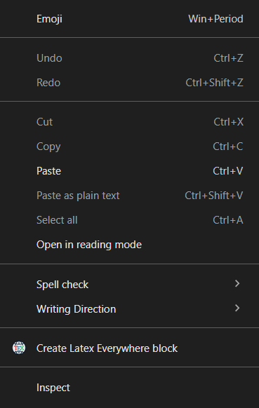
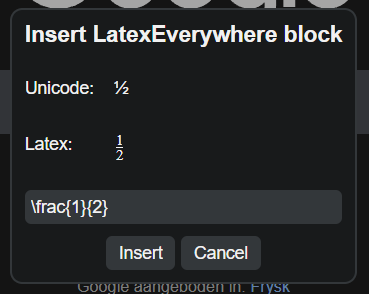

# 🌐 LatexEverywhere

> *A chrome extension to write latex on sites that don't support it*

## 🌟 Highlights

- LaTeX to unicode conversion
- Renders as LaTeX for everyone with the extension 
- Makes it easy to write math that don't support LaTeX

## 🚀 Usage

1. Right click on any text area on a webpage.
2. Click 'Create Latex Everywhere Block' in the context menu
3. Write your LaTeX code in the popup that appears
4. Click 'Insert', and the LaTeX code will be stored and rendered for everyone with the extension!

## ⬇️ Installation

### From Chrome Web Store
1. Go to the [Chrome Web Store](https://chromewebstore.google.com/) and search for "LatexEverywhere".
2. Click on the "Add to Chrome" button to install the extension.
3. Once installed, you should see the LatexEverywhere icon in your browser toolbar and the context menu when you right-click on text areas.

### From Release File
1. Go to the [Releases](https://github.com/FunMetJoel/LatexEverywhere/releases)
2. Download the latest `.crx` file from the releases section.
3. Go to [chrome://extensions/](chrome://extensions/) in your Chrome browser.
4. Enable "Developer mode" using the toggle switch in the top right corner. 
5. Drag and drop the downloaded `.crx` file onto the extensions page to install it.
6. Once installed, you should see the LatexEverywhere icon in your browser toolbar and the context menu when you right-click on text areas.

### From Source
1. Clone the repository
2. Go to [chrome://extensions/](chrome://extensions/) in your Chrome browser.
3. Enable "Developer mode" using the toggle switch in the top right corner.
4. Click on "Load unpacked" and select the cloned repository folder.
5. Once installed, you should see the LatexEverywhere icon in your browser toolbar and the context menu when you right-click on text areas.

## 💭 Feedback and Contributing

Feel free to open issues or submit pull requests on the [GitHub repository](https://github.com/FunMetJoel/LatexEverywhere). Your feedback and contributions are welcome!